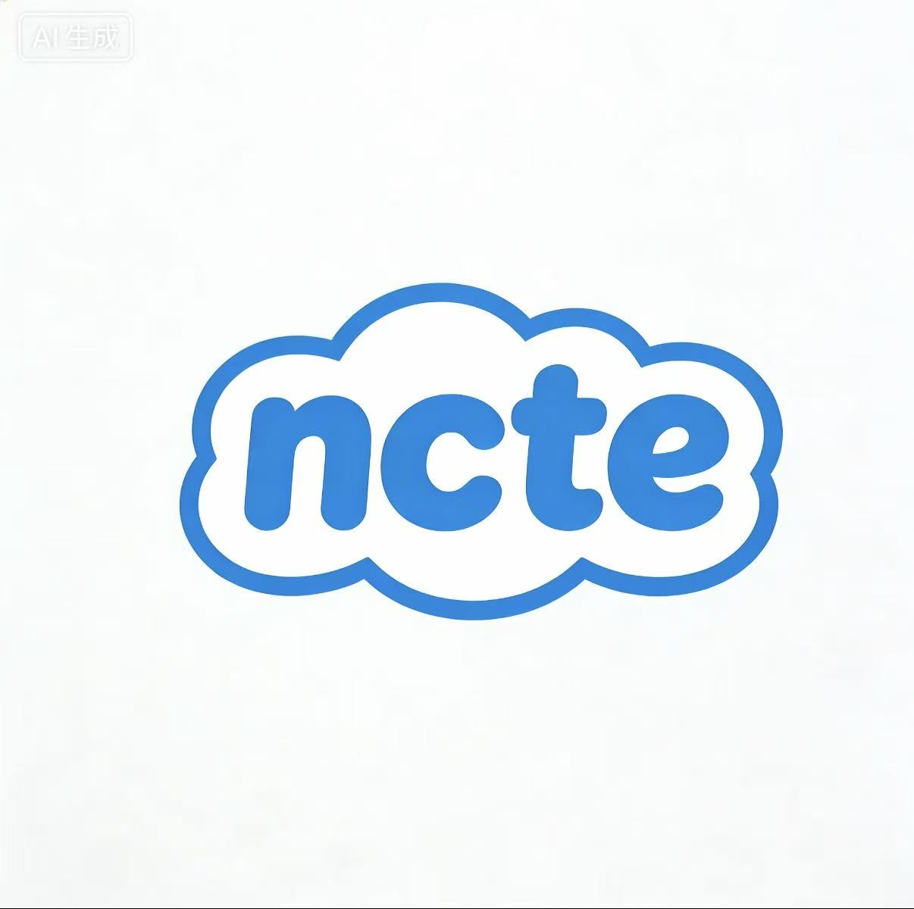

<p align="center">
  
</p>

<h1 align="center">NotePadC</h1>

<p align="center">
  <strong>A lightweight C code editor for macOS</strong>
</p>

<p align="center">
  <a href="#features">Features</a> •
  <a href="#installation">Installation</a> •
  <a href="#development">Development</a> •
  <a href="#license">License</a>
</p>

<p align="center">
  
  
  
  
</p>

---

## ✨ Features

- 🎨 **Clean UI** - Blue-white theme with dark mode support
- ⚡ **Fast** - Optimized with Trie-based autocomplete and virtual rendering
- 🔧 **C89/ANSI C** - Turbo C compatible compilation
- 💡 **Smart Completions** - Keywords, functions, headers, and snippets
- 📁 **Multi-tab** - Work with multiple files simultaneously
- 🔄 **Auto Save** - Never lose your work
- 🌙 **Theme Toggle** - Smooth sun/moon transition animation

## 📦 Installation

### Download

Download the latest `.dmg` from [Releases](../../releases).

### Build from Source

```bash
# Clone the repo
git clone https://github.com/YOUR_USERNAME/NotePadC.git
cd NotePadC

# Install dependencies
npm install

# Run in development
npm run dev

# Build for production
npm run build
```

## 🛠 Development

```bash
# Start dev server
npm run dev

# Run tests
npm test

# Build app
npm run build
```

### Tech Stack

- **Electron** - Cross-platform desktop app
- **React 18** - UI framework
- **Monaco Editor** - Code editing
- **Zustand** - State management
- **Vite** - Build tool

## 📸 Screenshots

<p align="center">
  <em>Light Mode</em>
</p>

<p align="center">
  <em>Dark Mode</em>
</p>

## 🤝 Contributing

PRs welcome! Feel free to open issues for bugs or feature requests.

## 📄 License

MIT © 2024

---

<p align="center">
  Made with ❤️ for C programmers
</p>
